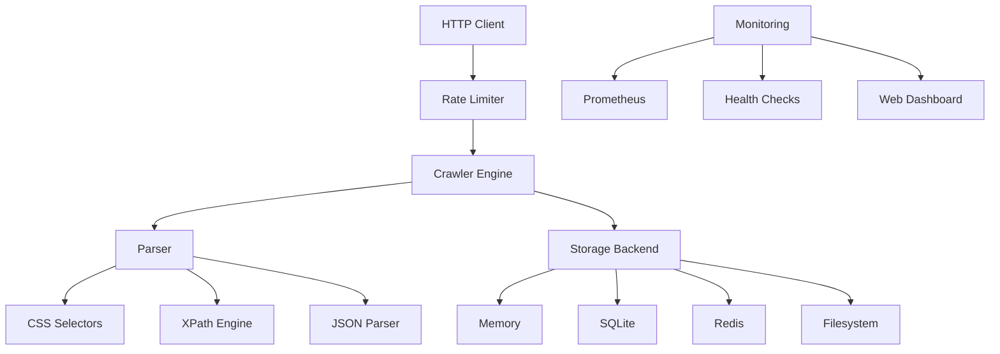

# Swoop 🚀

> Lightning-fast web crawler and data extraction engine with production-grade monitoring

[](https://www.rust-lang.org)
[](https://opensource.org/licenses/MIT)
[]()
[](https://crates.io/crates/swoop)

**Swoop** is a high-performance, async-first web crawler built in Rust that makes data extraction effortless. Whether you're building a search engine, monitoring competitors, or gathering research data, Swoop handles it with speed and reliability.

## ✨ Features

- 🚀 **Blazing Fast**: Async-first architecture with intelligent rate limiting
- 🔍 **Smart Extraction**: CSS selectors, XPath, JSON parsing, and custom rules
- 📊 **Production Ready**: Built-in Prometheus metrics, health checks, and monitoring
- 🔒 **Thread Safe**: Concurrent crawling with proper synchronization
- 🎯 **Zero Config**: Works out of the box with sensible defaults
- 🌐 **Web Server**: Built-in HTTP server with REST API
- 💾 **Multiple Storage**: Memory, SQLite, Redis, and filesystem backends
- 🛡️ **Rate Limiting**: Per-domain and global rate limiting with burst capacity
- 📈 **Real-time Stats**: Live crawling statistics and performance metrics
- 🔧 **Extensible**: Plugin architecture for custom parsers and extractors

## 🚀 Quick Start

### Installation

Add Swoop to your `Cargo.toml`:

```toml
[dependencies]
swoop = "0.1"
tokio = { version = "1.0", features = ["full"] }
```

### Basic Usage

```rust
use swoop::{Crawler, CrawlRequest};

#[tokio::main]
async fn main() -> Result<(), Box<dyn std::error::Error>> {
    // Create a new crawler
    let crawler = Crawler::new().await?;
    
    // Configure what to extract
    let mut request = CrawlRequest::new("https://example.com");
    request.add_css_selector("title", "title, h1");
    request.add_css_selector("links", "a[href]");
    
    // Crawl and extract
    let result = crawler.crawl(request).await?;
    
    println!("Title: {}", result.title.unwrap_or_default());
    println!("Found {} links", result.extracted_data.len());
    
    Ok(())
}
```

### Server Mode

Launch Swoop as a web server with monitoring:

```bash
cargo run --bin swoop_demo --features monitoring
```

Then visit:
- 🌐 **Dashboard**: http://localhost:8080/dashboard
- 📊 **Metrics**: http://localhost:8080/metrics
- ❤️ **Health**: http://localhost:8080/health

## 📋 Examples

### Advanced Extraction

```rust
use swoop::{Crawler, CrawlRequest, SelectorType};

let mut request = CrawlRequest::new("https://news.ycombinator.com");

// Extract titles with CSS selectors
request.add_extraction_rule("titles", SelectorType::CSS, ".titleline > a");

// Extract metadata with XPath
request.add_extraction_rule("scores", SelectorType::XPath, "//span[@class='score']");

// Extract JSON data
request.add_extraction_rule("api_data", SelectorType::JSONPath, "$.data.articles[*].title");

let result = crawler.crawl(request).await?;
```

### Rate Limiting

```rust
use swoop::{Crawler, RateLimitConfig};

let rate_config = RateLimitConfig {
    requests_per_second: 2,
    burst_capacity: 5,
    default_delay_ms: 500,
    ip_requests_per_minute: 60,
    global_requests_per_second: 10,
};

let crawler = Crawler::with_rate_limit(rate_config).await?;
```

### Storage Backends

```rust
use swoop::{Crawler, FileSystemStorage, RedisStorage};

// Filesystem storage
let storage = FileSystemStorage::new("./crawl_data").await?;
let crawler = Crawler::with_storage(Box::new(storage)).await?;

// Redis storage (distributed crawling)
let storage = RedisStorage::new("redis://localhost:6379").await?;
let crawler = Crawler::with_storage(Box::new(storage)).await?;
```

## 🛠️ Configuration

Swoop is highly configurable through environment variables or configuration files:

```toml
# swoop.toml
[crawler]
max_concurrent_requests = 10
request_timeout_ms = 30000
user_agent = "Swoop/1.0 (Your Bot Description)"

[rate_limiting]
requests_per_second = 1
burst_capacity = 3
default_delay_ms = 1000

[storage]
type = "filesystem"
path = "./data"

[monitoring]
enable_metrics = true
metrics_port = 9090
```

## 📊 Monitoring & Observability

Swoop includes comprehensive monitoring out of the box:

### Prometheus Metrics
- Request counts and rates
- Response time histograms
- Error rates by type
- Active connections
- Storage statistics

### Health Checks
- `/health` - Basic health status
- `/ready` - Readiness probe (Kubernetes-ready)
- `/metrics` - Prometheus metrics
- `/stats` - Real-time statistics JSON

### Dashboard
Beautiful web dashboard showing:
- Live crawling activity
- Performance graphs
- Error tracking
- Storage usage
- Rate limiting status

## 🏗️ Architecture



## 🚢 Deployment

### Docker

```dockerfile
FROM rust:1.70 as builder
WORKDIR /app
COPY . .
RUN cargo build --release

FROM debian:bookworm-slim
RUN apt-get update && apt-get install -y ca-certificates
COPY --from=builder /app/target/release/swoop_demo /usr/local/bin/
EXPOSE 8080
CMD ["swoop_demo", "--server", "--port", "8080"]
```

### Kubernetes

```yaml
apiVersion: apps/v1
kind: Deployment
metadata:
  name: swoop
spec:
  replicas: 3
  selector:
    matchLabels:
      app: swoop
  template:
    metadata:
      labels:
        app: swoop
    spec:
      containers:
      - name: swoop
        image: codewithkenzo/swoop:latest
        ports:
        - containerPort: 8080
        livenessProbe:
          httpGet:
            path: /health
            port: 8080
        readinessProbe:
          httpGet:
            path: /ready
            port: 8080
```

## 🔧 Development

### Building from Source

```bash
git clone https://github.com/codewithkenzo/swoop.git
cd swoop
cargo build --release
```

### Running Tests

```bash
# Unit tests
cargo test

# Integration tests
cargo test --test integration_tests

# Benchmarks
cargo bench
```

### Contributing

1. Fork the repository
2. Create a feature branch: `git checkout -b feature/amazing-feature`
3. Make your changes and add tests
4. Ensure tests pass: `cargo test`
5. Commit your changes: `git commit -m 'Add amazing feature'`
6. Push to the branch: `git push origin feature/amazing-feature`
7. Open a Pull Request

## 📝 License

This project is licensed under the MIT License - see the [LICENSE](LICENSE) file for details.

## 🤝 Support

- 📖 **Documentation**: [Coming Soon]
- 💬 **Discord**: [Coming Soon]
- 🐛 **Issues**: [GitHub Issues](https://github.com/codewithkenzo/swoop/issues)
- 📧 **Email**: [codewithkenzo@github.com]

## 🌟 Showcase

**Built with Swoop:**
- 🔍 **Search Engines**: Index millions of pages efficiently
- 📊 **Market Research**: Monitor competitor prices and content
- 📰 **News Aggregation**: Collect articles from multiple sources
- 🏢 **Lead Generation**: Extract contact information at scale
- 📈 **SEO Analysis**: Analyze website structures and content

---

<p align="center">
  <strong>Made with ❤️ by <a href="https://github.com/codewithkenzo">@codewithkenzo</a></strong>
</p>

<p align="center">
  ⭐ <strong>Star us on GitHub if Swoop helps you!</strong> ⭐
</p> 