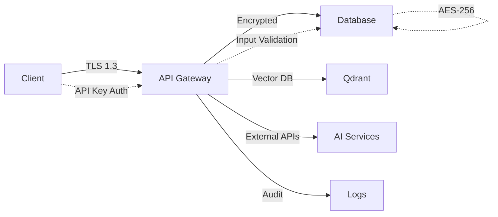

import { Callout } from 'fumadocs-ui/components/callout'
import { Tabs, Tab } from 'fumadocs-ui/components/tabs'
import { Card, Cards } from 'fumadocs-ui/components/card'

# Security & Compliance Guide

Swoop is designed with security-first principles, implementing enterprise-grade protection for your documents and data.

## Security Architecture

<Callout type="info">
**Threat Model**: Swoop protects against external attacks, internal threats, and misconfigurations through comprehensive security controls.
</Callout>

### Security Controls Overview

<Cards>
  <Card
    title="Authentication & Authorization"
    description="API key management, RBAC, rate limiting, session management"
    icon="🔐"
  />
  <Card
    title="Data Protection"
    description="AES-256 encryption at rest, TLS 1.3 in transit, secure key management"
    icon="🛡️"
  />
  <Card
    title="Application Security"
    description="Input validation, SQL injection prevention, XSS protection"
    icon="🔒"
  />
  <Card
    title="Infrastructure Security"
    description="Container security, network segmentation, monitoring & alerting"
    icon="🏗️"
  />
</Cards>

### Data Flow Security



## Authentication & Authorization

### API Key Management

<Tabs items={['Implementation', 'Configuration', 'Best Practices']}>
<Tab value="Implementation">

```rust
// src/auth/api_keys.rs
use argon2::{Argon2, PasswordHasher, PasswordVerifier};
use rand::Rng;

pub struct ApiKeyManager {
    hasher: Argon2<'static>,
    salt: [u8; 32],
}

impl ApiKeyManager {
    pub fn generate_key(&self, user_id: &str) -> Result<String> {
        let random_bytes: [u8; 32] = rand::thread_rng().gen();
        let key = format!("swoop_sk_{}", hex::encode(random_bytes));
        let hash = self.hash_key(&key)?;
        
        // Store hash in database
        self.store_key_hash(user_id, &hash)?;
        Ok(key)
    }
    
    pub fn verify_key(&self, key: &str) -> Result<bool> {
        let stored_hash = self.get_stored_hash(key)?;
        match stored_hash {
            Some(hash) => Ok(self.hasher.verify_password(key.as_bytes(), &hash).is_ok()),
            None => Ok(false),
        }
    }
}
```

</Tab>
<Tab value="Configuration">

```bash
# Security Configuration
ENCRYPTION_KEY="your-32-byte-encryption-key-base64"
API_KEY_SALT="your-32-byte-salt-base64"
JWT_SECRET="your-jwt-secret-key"

# Rate Limiting
RATE_LIMIT_RPM=100
RATE_LIMIT_BURST=20

# CORS Configuration
CORS_ORIGINS="https://app.yourdomain.com,https://docs.yourdomain.com"
```

</Tab>
<Tab value="Best Practices">

**Key Generation:**
- Use cryptographically secure random generation
- 256-bit keys minimum
- Unique salt per installation
- Secure storage of hashed keys

**Key Management:**
- Regular key rotation (quarterly)
- Immediate revocation on compromise
- Audit log for all key operations
- Separate keys for different environments

**Distribution:**
- Secure channels only (encrypted email, secure chat)
- Never log API keys in plain text
- Environment variables, not code
- Documentation should use placeholders

</Tab>
</Tabs>

### Role-Based Access Control

```rust
// src/auth/rbac.rs
#[derive(Debug, Clone, PartialEq)]
pub enum Permission {
    DocumentRead,
    DocumentWrite,
    DocumentDelete,
    AdminAccess,
    ApiKeyManage,
}

#[derive(Debug, Clone)]
pub enum Role {
    User,
    Admin,
    Service,
}

impl Role {
    pub fn permissions(&self) -> Vec<Permission> {
        match self {
            Role::User => vec![
                Permission::DocumentRead,
                Permission::DocumentWrite,
            ],
            Role::Admin => vec![
                Permission::DocumentRead,
                Permission::DocumentWrite,
                Permission::DocumentDelete,
                Permission::AdminAccess,
                Permission::ApiKeyManage,
            ],
            Role::Service => vec![
                Permission::DocumentRead,
                Permission::DocumentWrite,
            ],
        }
    }
}
```

## Data Protection

### Encryption Implementation

<Tabs items={['At Rest', 'In Transit', 'Key Management']}>
<Tab value="At Rest">

```rust
// src/security/encryption.rs
use aes_gcm::{Aes256Gcm, Key, Nonce};
use aes_gcm::aead::{Aead, NewAead};

pub struct DataEncryption {
    cipher: Aes256Gcm,
}

impl DataEncryption {
    pub fn encrypt(&self, data: &[u8]) -> Result<Vec<u8>> {
        let nonce_bytes: [u8; 12] = rand::thread_rng().gen();
        let nonce = Nonce::from_slice(&nonce_bytes);
        
        let mut encrypted = self.cipher.encrypt(nonce, data)?;
        
        // Prepend nonce to encrypted data
        let mut result = nonce_bytes.to_vec();
        result.append(&mut encrypted);
        Ok(result)
    }
    
    pub fn decrypt(&self, data: &[u8]) -> Result<Vec<u8>> {
        let (nonce_bytes, encrypted) = data.split_at(12);
        let nonce = Nonce::from_slice(nonce_bytes);
        
        self.cipher.decrypt(nonce, encrypted)
            .map_err(|e| Error::DecryptionFailed(e.to_string()))
    }
}
```

**Features:**
- **AES-256-GCM**: Authenticated encryption
- **Unique nonces**: Per-encryption randomness
- **Authenticated**: Tamper detection included
- **Performance**: Hardware acceleration when available

</Tab>
<Tab value="In Transit">

**TLS Configuration:**
```yaml
# docker-compose.prod.yml
services:
  swoop-api:
    environment:
      - TLS_CERT_PATH=/certs/server.crt
      - TLS_KEY_PATH=/certs/server.key
      - TLS_MIN_VERSION=1.3
    volumes:
      - ./certs:/certs:ro
```

**Security Headers:**
```rust
// Axum middleware
.layer(
    CorsLayer::new()
        .allow_origin("https://yourdomain.com".parse::<HeaderValue>()?)
        .allow_methods([Method::GET, Method::POST])
        .allow_headers([CONTENT_TYPE, AUTHORIZATION])
)
.layer(
    ServiceBuilder::new()
        .layer(SetResponseHeaderLayer::if_not_present(
            header::STRICT_TRANSPORT_SECURITY,
            HeaderValue::from_static("max-age=31536000; includeSubDomains"),
        ))
        .layer(SetResponseHeaderLayer::if_not_present(
            header::X_CONTENT_TYPE_OPTIONS,
            HeaderValue::from_static("nosniff"),
        ))
)
```

</Tab>
<Tab value="Key Management">

**Environment Variables:**
```bash
# Production key management
ENCRYPTION_KEY=$(openssl rand -base64 32)
API_KEY_SALT=$(openssl rand -base64 32)
JWT_SECRET=$(openssl rand -base64 64)

# Key rotation (quarterly)
NEW_ENCRYPTION_KEY=$(openssl rand -base64 32)
```

**Key Rotation Process:**
1. Generate new key
2. Deploy with both old and new keys
3. Encrypt new data with new key
4. Migrate existing data (background process)
5. Remove old key after migration complete

**Backup and Recovery:**
- Encrypted key backups
- Secure key escrow for critical deployments
- Recovery procedures documented
- Regular backup testing

</Tab>
</Tabs>

## Audit Logging

### Comprehensive Event Tracking

```rust
// src/audit/logger.rs
#[derive(Debug, Clone, Serialize, Deserialize)]
pub struct AuditEvent {
    pub id: Uuid,
    pub timestamp: DateTime<Utc>,
    pub user_id: Option<String>,
    pub event_type: EventType,
    pub resource: String,
    pub action: String,
    pub result: EventResult,
    pub metadata: serde_json::Value,
    pub client_ip: String,
}

#[derive(Debug, Clone, Serialize, Deserialize)]
pub enum EventType {
    Authentication,
    Authorization, 
    DataAccess,
    DataModification,
    SystemChange,
    SecurityEvent,
}

impl AuditLogger {
    pub async fn log_document_access(
        &self, 
        user_id: &str, 
        document_id: &str, 
        action: &str,
        client_ip: &str
    ) -> Result<()> {
        let event = AuditEvent {
            id: Uuid::new_v4(),
            timestamp: Utc::now(),
            user_id: Some(user_id.to_string()),
            event_type: EventType::DataAccess,
            resource: format!("document:{}", document_id),
            action: action.to_string(),
            result: EventResult::Success,
            metadata: serde_json::json!({"document_id": document_id}),
            client_ip: client_ip.to_string(),
        };
        
        self.log_event(event).await
    }
}
```

### Logged Events

| Event Type | Description | Retention |
|------------|-------------|-----------|
| **Authentication** | Login attempts, API key usage | 1 year |
| **Data Access** | Document views, downloads | 2 years |
| **Data Modification** | Uploads, deletions, updates | 7 years |
| **Security Events** | Failed auth, suspicious activity | 5 years |
| **System Changes** | Configuration, user management | 3 years |

## Compliance Frameworks

### GDPR Compliance

<Callout type="warn">
**Data Subject Rights**: Swoop implements all required GDPR rights including access, rectification, erasure, and portability.
</Callout>

```rust
// src/compliance/gdpr.rs
impl GDPRCompliance {
    pub async fn export_user_data(&self, user_id: &str) -> Result<UserDataExport> {
        let documents = self.get_user_documents(user_id).await?;
        let activities = self.get_user_activities(user_id).await?;
        
        let export = UserDataExport {
            user_id: user_id.to_string(),
            export_date: Utc::now(),
            documents,
            activities,
        };
        
        // Log GDPR export request
        self.audit.log_gdpr_event("data_export", user_id).await?;
        Ok(export)
    }
    
    pub async fn delete_user_data(&self, user_id: &str) -> Result<()> {
        // Secure deletion with overwrite
        self.secure_delete_documents(user_id).await?;
        self.secure_delete_activities(user_id).await?;
        
        self.audit.log_gdpr_event("data_deletion", user_id).await?;
        Ok(())
    }
}
```

**GDPR Implementation:**
- **Lawful basis**: Consent and legitimate interest documented
- **Data minimization**: Only necessary data collected
- **Storage limitation**: Automatic data retention policies
- **Privacy by design**: Built-in privacy protections
- **Data processor agreements**: With AI service providers

### SOC 2 Compliance

**Control Objectives:**

<Cards>
  <Card
    title="Security"
    description="Encryption, access controls, monitoring, incident response"
  />
  <Card
    title="Availability"
    description="High availability, disaster recovery, performance monitoring"
  />
  <Card
    title="Processing Integrity"
    description="Data validation, error handling, quality controls"
  />
  <Card
    title="Confidentiality"
    description="Data classification, access restrictions, secure transmission"
  />
  <Card
    title="Privacy"
    description="Data handling procedures, consent management, breach notification"
  />
</Cards>

### HIPAA Compliance

For healthcare implementations:

**Administrative Safeguards:**
- Security officer designation
- Workforce security training
- Access management procedures
- Incident response protocols

**Physical Safeguards:**
- Facility access controls
- Workstation security
- Media disposal procedures

**Technical Safeguards:**
- Access control systems
- Audit controls and logging
- Data integrity measures
- Transmission security

## Production Security Checklist

### Infrastructure Security

- [ ] **TLS 1.3** encryption for all communications
- [ ] **Network segmentation** with firewalls
- [ ] **Container security** with non-root users
- [ ] **Regular updates** and security patches
- [ ] **Intrusion detection** systems configured
- [ ] **DDoS protection** in place
- [ ] **Backup encryption** and testing

### Application Security

- [ ] **Input validation** for all endpoints
- [ ] **SQL injection prevention** with parameterized queries
- [ ] **XSS protection** with output encoding
- [ ] **CSRF tokens** for state-changing operations
- [ ] **Secure headers** configured
- [ ] **Rate limiting** implemented
- [ ] **API versioning** for backward compatibility

### Data Security

- [ ] **Encryption at rest** with AES-256
- [ ] **Key rotation** procedures documented
- [ ] **Secure backups** with encryption
- [ ] **Data classification** policies
- [ ] **Retention policies** automated
- [ ] **Secure deletion** procedures
- [ ] **Access logging** comprehensive

### Access Control

- [ ] **Strong authentication** with API keys
- [ ] **Role-based access** control implemented
- [ ] **Principle of least privilege** enforced
- [ ] **Regular access reviews** scheduled
- [ ] **Session management** secure
- [ ] **Multi-factor authentication** available
- [ ] **Account lockout** policies

### Monitoring and Response

- [ ] **Security monitoring** 24/7
- [ ] **Incident response** plan tested
- [ ] **Vulnerability scanning** automated
- [ ] **Penetration testing** annual
- [ ] **Log analysis** automated
- [ ] **Alerting** configured
- [ ] **Forensic capabilities** available

## Incident Response

### Security Incident Process

```rust
// src/security/incident.rs
#[derive(Debug, Clone)]
pub struct SecurityIncident {
    pub id: Uuid,
    pub severity: IncidentSeverity,
    pub description: String,
    pub affected_resources: Vec<String>,
    pub detected_at: DateTime<Utc>,
    pub status: IncidentStatus,
}

#[derive(Debug, Clone)]
pub enum IncidentSeverity {
    Low,      // Information disclosure
    Medium,   // Service disruption
    High,     // Data compromise
    Critical, // System compromise
}

impl IncidentResponse {
    pub async fn report_incident(&self, incident: SecurityIncident) -> Result<()> {
        // Immediate logging
        self.audit.log_security_incident(&incident).await?;
        
        // Automated response based on severity
        match incident.severity {
            IncidentSeverity::Critical => {
                self.execute_emergency_response(&incident).await?;
                self.notify_security_team_immediate(&incident).await?;
            }
            IncidentSeverity::High => {
                self.isolate_affected_resources(&incident).await?;
                self.notify_security_team_urgent(&incident).await?;
            }
            _ => {
                self.notify_security_team_standard(&incident).await?;
            }
        }
        
        Ok(())
    }
}
```

### Response Procedures

**Critical Incidents (< 15 minutes):**
1. Automatic system isolation
2. Emergency team notification
3. Customer communication
4. Forensic evidence preservation

**High Severity (< 1 hour):**
1. Affected resource isolation
2. Security team activation
3. Impact assessment
4. Containment measures

**Medium/Low (< 4 hours):**
1. Standard investigation
2. Root cause analysis
3. Remediation planning
4. Process improvements

## Vulnerability Management

### Security Testing

<Tabs items={['Automated Scanning', 'Manual Testing', 'Reporting']}>
<Tab value="Automated Scanning">

```yaml
# .github/workflows/security.yml
name: Security Scanning
on: [push, pull_request]

jobs:
  security:
    runs-on: ubuntu-latest
    steps:
      - uses: actions/checkout@v3
      
      - name: Rust Security Audit
        run: |
          cargo install cargo-audit
          cargo audit
      
      - name: Container Scanning
        run: |
          docker build -t swoop:latest .
          trivy image swoop:latest
      
      - name: SAST Scanning
        uses: github/codeql-action/analyze@v2
        with:
          languages: rust, javascript
      
      - name: Dependency Check
        run: |
          npm audit --audit-level moderate
          cargo outdated
```

**Scanning Schedule:**
- **Daily**: Dependency vulnerabilities
- **Weekly**: Container image scanning
- **Monthly**: Full SAST analysis
- **Quarterly**: Penetration testing

</Tab>
<Tab value="Manual Testing">

**Penetration Testing Scope:**
- API endpoint security testing
- Authentication and authorization bypass
- Input validation and injection attacks
- Business logic vulnerabilities
- Infrastructure security assessment

**Testing Methodology:**
1. **Reconnaissance**: Information gathering
2. **Scanning**: Vulnerability identification
3. **Exploitation**: Proof of concept
4. **Post-exploitation**: Impact assessment
5. **Reporting**: Findings and recommendations

</Tab>
<Tab value="Reporting">

**Vulnerability Disclosure:**
- **Private reporting**: security@swoop.dev
- **Response time**: 24-48 hours acknowledgment
- **Fix timeline**: 90 days for non-critical, 30 days for critical
- **Recognition**: Security researcher acknowledgments

**Internal Reporting:**
- **Risk assessment**: CVSS scoring
- **Priority classification**: Based on exploitability and impact
- **Remediation tracking**: Automated ticket creation
- **Metrics**: Time to detect, respond, and remediate

</Tab>
</Tabs>

## Contact and Support

### Security Contact

**Email**: security@swoop.dev  
**PGP Key**: [Available on website]  
**Response Time**: 24-48 hours for initial response

### Reporting Security Issues

1. **Email** security concerns to security@swoop.dev
2. **Include** detailed description and reproduction steps
3. **Provide** your contact information for follow-up
4. **Allow** reasonable time for investigation and fix
5. **Coordinate** public disclosure timing

### Security Resources

- **Security Policy**: [GitHub Security Policy](https://github.com/your-org/swoop/security/policy)
- **Advisories**: [Security Advisories](https://github.com/your-org/swoop/security/advisories)
- **Bug Bounty**: Contact us for responsible disclosure program details

---

This security guide is regularly updated to reflect current best practices and threat landscape changes. For the latest security information, visit our [security portal](https://security.swoop.dev).